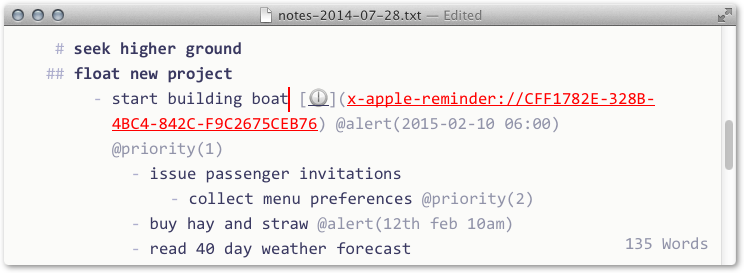
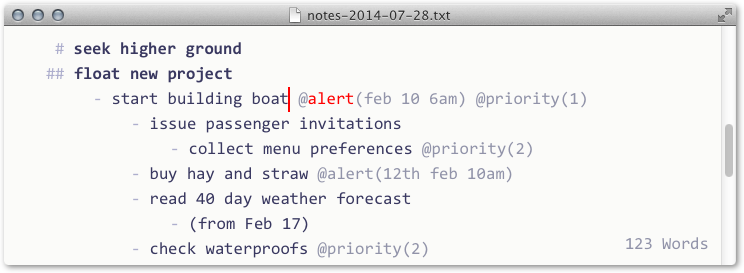
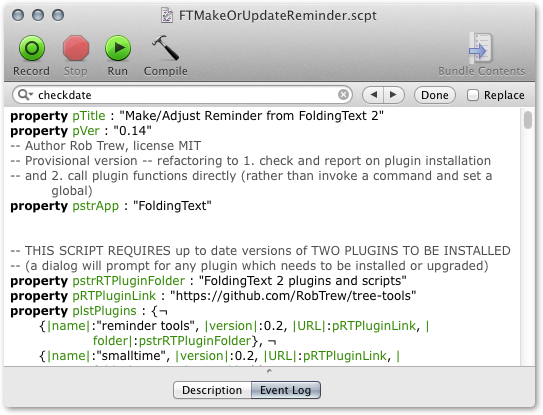
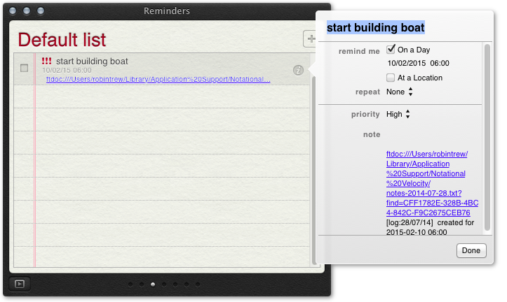

# Plain text project files with links to and from Reminders.app
Nothing beats plain text outlines for quickly and flexibly gathering thoughts and developing project structure, and well synched databases like Reminders.app are very good for automating alerts.

Plain text and Reminders work well with each other, and we can script the creation of links (and exchange of data) between them.

## Create links back and forth between plain text and reminders,

- Plain text notes can contain links to alerts in Reminders.app
		
	- This is made possible by the URL scheme of Reminders.app,
		- x-apple-reminder://
				
				
	- and we can copy/make links automatically.
		- We can either copy from existing Reminders
				
				

			- EITHER as TaskPaper / FoldingText entries, [with this script,](./CopyReminderAsTaskPaperOrFT.applescript)
					
					
					- Result with MD link and TaskPaper-style tags:

					    - Release a raven and a dove after 40 days  [🕖](x-apple-reminder://144D021C-06D7-4FE0-AE28-76295FDCB08C) @list(voyage) @alert(2015-03-29 07:00) @priority(2)

			- OR simply as MD links, [with another script.](./CopyReminderAsLink.applescript)
					
					
					- Resulting link to a reminder:
					   
							    [🕖](x-apple-reminder://144D021C-06D7-4FE0-AE28-76295FDCB08C)
	
		- or we can automatically push details from plain text entries to create new reminders (or update existing reminders)
			1. Select a line which contains an `@alert(date/time) tag (the date/time can be informal or relative) ...
					
					
					
			2. Run the script FTMakeOrUpdateReminder.scpt in Applescript Editor
					
					

				- A clock-faced link to a new reminder is created
						
						

				- and the note of the new reminder also contains a link **back** to the FoldingText entry.
						
						
				
### The links from Reminders.app back to plain text
- There are url schemes for linking to particular lines TaskPaper and Foldingtext files,
	- [ftdoc://](https://github.com/RobTrew/txtquery-tools/blob/master/ftdoc%20url%20scheme%20and%20FTCopyAsURL/README.md)
	- [tp3doc://](https://github.com/RobTrew/txtquery-tools/blob/master/tp3doc%20url%20scheme%20and%20TP3CopyAsURL/README.md)
- To download and install these url schemes, see:
	- [FoldingText 2 url scheme ftdoc://](https://github.com/RobTrew/txtquery-tools/blob/master/ftdoc%20url%20scheme%20and%20FTCopyAsURL/README.md)
	- [TaskPaper 3 url scheme tp3doc://](https://github.com/RobTrew/txtquery-tools/blob/master/tp3doc%20url%20scheme%20and%20TP3CopyAsURL/README.md)
		

## and we can push or pull adjustments to the details.

- Using scripts
	- Script - FT-Push-to-Reminder
	- Script - FT-Pull-from-Reminder
	- Toggle done at both ends
- to link reminders with @key(value) tags
	- @alert(yyyy-mm-dd HH:MM)
	- @priority(1|2|3)
	- @done(yyyy-mm-dd HH:MM)
	- @cal(list name)

(then running the script again will update the linked Reminder ...)

